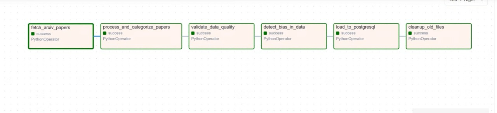
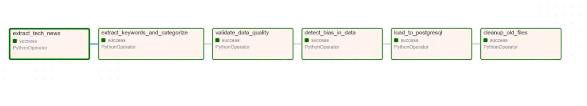

# Research AI Chatbot-DataPipeline

## Setting Up Your Development Environment
Please follow these two essential steps:
### 1. Downloading the Repository
To download this repository, use the following commands depending on your operating system.
### On Mac & Windows 
Open a terminal and run:
```bash
git clone https://github.com/YashwanthReddy27/MLOps_Grp_6.git
```
This will create a local copy of the repository on your machine.

### 2. Create the Virtual Environment
First, create an isolated environment to house your project dependencies. Execute the following commands:

```bash
python3 -m venv venv
```

```bash
# For Windows
.\venv\Scripts\activate
# For macOS and Linux
source venv/bin/activate
```

### 3. Install All Required Libraries
Next, activate your virtual environment and install the necessary libraries in one swift command:

```bash
# Install all dependencies
pip install -r requirements.txt
pip install -r requirements-test.txt 
```
install the requirements in the tests folder if those packages are not there in your PC.

### 4. Set Up Docker
1. Download Docker:
   Go to the Docker website. Choose the appropriate Docker Desktop version for your operating system (Windows, Mac, or Linux).
2. Install Docker.
   Follow the installation instructions specific to your OS.
   - Windows: Run the installer and follow the prompts. Make sure to enable Windows Subsystem for Linux (WSL) if prompted.
   - Mac: Open the downloaded .dmg file, drag Docker to your Applications folder, and launch it.
   - Linux: Install Docker Engine by using commands specified in the Docker website.
  
3. Verify Installation:
   Run the following command to check if Docker is installed correctly:
```bash
docker --version
```

### 5. Set Up Email Notifications
1. Navigate to the email_config.yaml file in the repository
2. Update the following fields: 
   ```bash
   smtp_server = smtp.gmail.com
   sender_email = <your gmail ID>
   sender_password = <your Gmail authenticated app password>
   smtp_port = 587
   ```
   - smtp_server: Set to smtp.gmail.com for Gmail SMTP.
   - sender_email: Your full Gmail email address (e.g., youremail@gmail.com).
   - sender_password: Your Gmail authenticated app password. Ensure you have enabled App Passwords in your Google account settings.
   - smtp_port: Use 587 
   
## 6. Run Airflow with Docker Compose

This guide explains how to initialize and run Apache Airflow using the provided `docker-compose.yaml` configuration file.
**Create bias_reports folder in data if the data bias task fails when running the dag**

### Prerequisites
- **Docker** and **Docker Compose** installed on your local machine  
- The `docker-compose.yaml` file must be located in the project’s root directory

### Initialization

Before starting the Airflow services, initialize the Airflow environment and database:

```
docker compose up airflow-init
```

This command sets up directories, initializes the metadata database, and prepares your environment for Airflow.

### Start Airflow Services

Once initialization is complete, start all Airflow containers (webserver, scheduler, worker, etc.):

```
docker compose  up
```

### Access the Airflow Web UI

After the containers start, open your browser and visit:

```
http://localhost:8080
```

You can log in using the credentials configured in your environment variables or the default Airflow credentials if provided.

### Stop and Clean Up

To stop the running containers:

```
docker compose down
```

To remove all associated volumes and networks as well:

```
docker compose down -v
```

## 7. Run the tests
To get the setup run
''' python
python test_runner_config.py --setup
'''

If you want to focus on fixing one module at a time
'''bash
python test_runner.py --module #Module_name# example: python test_runner.py --module data_validator
'''

Run all th tests at once amek sure you are in tests directory when you run this command
'''bash
python test_runner_config.py
'''

# Code Structure and Explanation

## Overview
This project contains a collection of data processing scripts and Airflow DAGs designed to handle data ingestion, validation, enrichment, and quality assurance for ArXiv academic papers and news data sources.

## Project Structure

### Core Data Processing

#### `data_cleaning.py`
Handles data sanitization, formatting, and normalization tasks to ensure consistent data quality across the pipeline.

#### `data_enrichment.py`
Adds supplementary information and enhances existing data with additional context and metadata.

#### `data_validator.py`
Validates data quality, completeness, and conformity to business rules, ensuring data meets required standards before processing.

#### `deduplication.py`
Identifies and removes duplicate records from datasets to maintain data integrity and prevent redundancy.

### Infrastructure & Support

#### `database_utils.py`
Provides database connection management and query execution utilities for seamless data persistence and retrieval.

#### `file_management.py`
Handles file operations including reading, writing, and organizing data files across the pipeline.

#### `send_email.py`
Email notification system for pipeline status updates and alerts, keeping stakeholders informed of processing outcomes.

### Validation Framework

#### `ge_validator.py`
Great Expectations validator implementation for comprehensive data quality checks and validation rules.

#### `data_validation.py`
Task wrapper for integrating Great Expectations validation into pipeline workflows.

#### `Schema_creator_module.py`
Creates explicit schemas for ArXiv and news data sources, providing a foundation for validating incoming data against expected formats.

## Airflow DAGs

Orchestration pipelines for automated data workflows.

### ArXiv Pipeline

#### `arxiv.py`
Pipeline for collecting and processing arxiv articles data from arxiv archive.

#### `arxiv_pipeline.py`
Main pipeline for processing ArXiv academic papers data, handling ingestion, transformation, and storage.

### News Pipeline

#### `news_api.py`
Pipeline for collecting and processing news data from various sources.

#### `news_pipeline.py`
News pipeline with comprehensive validation checks to maintain data accuracy and reliability.

## 8. Set Up DVC (Data Version Control)

DVC manages dataset versioning and synchronization between local and cloud storage.

Steps:

#### Initialize DVC

dvc init


#### Add Remote Storage

dvc remote add -d mygcp gs://citewise-dvc-store-8232761765
dvc remote add gcs gs://citewise-dvc-store-54873845389/resilienceai-datapipeline

#### Track and Push Data

dvc add data/raw
git add data/raw.dvc .dvc/config
git commit -m "Add initial data version"
dvc push


#### Best Practices

Commit only .dvc and config files to Git, not raw data.

Regularly push to both primary (mygcp) and backup (gcs) remotes.

Use .dvcignore to exclude temporary or large files.

### Mitigation Challenges:

We are unable to mitigate the data effectively, as any form of resampling would introduce synthetic papers into the dataset, potentially leading to inaccurate or misleading results.

Similarly, adding synthetic news data is not a viable option, as it could introduce artificial or false information into the model pipeline, compromising data integrity.

### Pipelines
We employed Airflow to modularize our Data Pipeline





### Folder Structure
<details>
<summary>Project Structure</summary>

```
researchAI/
│
├── imgs/
│
├── config/
│
├── dags/
│   ├── __pycache__/
│   ├── common/
│   │   ├── __pycache__/
│   │   ├── config/
│   │   │   └── email_config.yaml
│   │   ├── data_schema/
│   │   │   ├── arxiv/
│   │   │   │   ├── expectations/
│   │   │   │   │   └── arxiv_suite.json
│   │   │   │   ├── uncommitted/
│   │   │   │   │   ├── schema_metadata_20251027_185753.json
│   │   │   │   │   ├── validation_summary_20251028_013713.json
│   │   │   │   │   └── validation_summary_20251028_013715.json
│   │   │   │   └── validations/
│   │   │   │       ├── validation_20251028_013713.json
│   │   │   │       └── validation_20251028_013715.json
│   │   │   ├── news_api/
│   │   │   │   ├── expectations/
│   │   │   │   │   └── news_api_suite.json
│   │   │   │   ├── uncommitted/
│   │   │   │   │   ├── schema_metadata_20251027_185834.json
│   │   │   │   │   └── validation_summary_20251028_020246.json
│   │   │   │   └── validations/
│   │   │   │       └── validation_20251028_020245.json
│   │   │   └── train_data/
│   │   │       ├── arxiv_papers_processed_20251027_175420.json
│   │   │       └── tech_news_categorized_20251027_175547.json
│   │   ├── __init__.py
│   │   ├── bias_detection_fair_learn.py
│   │   ├── bias_detector.py
│   │   ├── data_cleaning.py
│   │   ├── data_enrichment.py
│   │   ├── data_validation.py
│   │   ├── data_validator.py
│   │   ├── database_utils.py
│   │   ├── deduplication.py
│   │   ├── file_management.py
│   │   ├── ge_validator.py
│   │   ├── schema_creator_module.py
│   │   └── send_email.py
│   ├── __init__.py
│   ├── arxiv.py
│   ├── arxiv_pipeline.py
│   ├── news_api.py
│   └── news_pipeline.py
│
├── data/
│   ├── cleaned/
│   ├── data/
│   ├── ge_artifacts/
│   ├── hashes/
│   ├── raw/
│   └── schema/
│
├── logs/
│
├── plugins/
│
├── providers/
│
├── scripts/
│
├── tests/
│   ├── __pycache__/
│   ├── .pytest_cache/
│   ├── tests/
│   ├── pytest.ini
│   ├── requirements-test.txt
│   ├── test_data_cleaning.py
│   ├── test_data_enrichment.py
│   ├── test_data_validator.py
│   ├── test_database_utils.py
│   ├── test_deduplication.py
│   ├── test_file_management.py
│   └── test_runner_config.py
│
├── .dvcignore
├── .env
├── .gitignore
├── docker-compose.yaml
├── image.png
├── README.md
├── Readme.md
└── requirements.txt
```

</details>