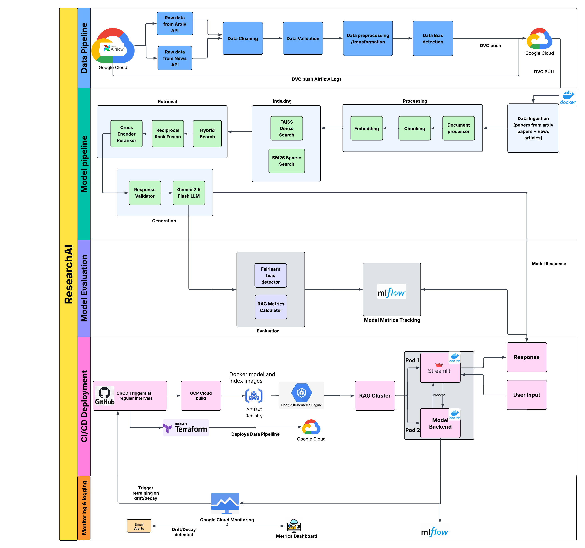

# Deployment Guide


This project deploys a **RAG-based research assistant** with two main components:

1. **Data Pipeline** (Cloud Composer/Airflow) - Fetches and processes research papers and news
2. **RAG Model** (GKE/Kubernetes) - Serves the AI model via FastAPI backend + Streamlit UI

Everything runs on **Google Cloud Platform** with full CI/CD automation via **GitHub Actions**.

---

## Architecture



```
┌─────────────────────────────────────────────────────────────┐
│  GitHub (Push to main)                                      │
└────────────┬────────────────────────────────────────────────┘
             │
             │ Triggers GitHub Actions
             ▼
┌─────────────────────────────────────────────────────────────┐
│  CI/CD Workflows (5 workflows)                              │
│  1. Deploy Cloud Composer (Terraform)                       │
│  2. Sync Data Pipeline (every 6 hours)                      │
│  3. Evaluate & Push Model                                   │
│  4. Deploy to Kubernetes                                    │
│  5. Monitor & Retrain (every 2 days)                        │
└────────────┬────────────────────────────────────────────────┘
             │
             ▼
┌─────────────────────────────────────────────────────────────┐
│  Google Cloud Platform                                      │
│                                                             │
│  Cloud Composer → Airflow DAGs → data/cleaned/              │
│        ↓                              ↓                     │
│  DVC (version control)        Model Indexing                │
│        ↓                              ↓                     │
│  GCS Buckets                  Artifact Registry             │
│                                       ↓                     │
│                               GKE (Kubernetes)              │
│                    Backend (FastAPI) + Frontend (Streamlit) │
│                                       ↓                     │
│                            Cloud Monitoring                 │
│                    (Check metrics & retrain if needed)      │
└─────────────────────────────────────────────────────────────┘
```

---

## Prerequisites

### Tools Required
```bash
gcloud --version    # Google Cloud SDK
kubectl version     # Kubernetes CLI
terraform version   # Terraform
docker --version    # Docker
python --version    # Python 3.11+
```

### GCP Setup
1. Create a GCP project
2. Enable APIs: `container`, `artifactregistry`, `composer`, `monitoring`, `storage`
3. Create 2 service accounts:
   - **rag-deployer** (Editor role) - for model deployment
   - **rag-dvc** (Storage Admin) - for data versioning

### GitHub Secrets
Configure these in your repo settings:

| Secret | What It's For |
|--------|---------------|
| `GCP_PROJECT_ID` | Your GCP project ID |
| `GCP_SA_KEY` | Service account JSON (rag-deployer) |
| `GCP_SA_DVC_KEY` | Service account JSON (rag-dvc) |
| `GCP_DVC_BUCKET` | DVC storage bucket (gs://your-bucket) |
| `GOOGLE_API_KEY` | Gemini API key |
| `EMAIL_USERNAME` | Gmail for notifications |
| `EMAIL_PASSWORD` | Gmail app password |
| `DEVELOPER_EMAIL` | Email for deployment notifications |

---

## Quick Start

### Option 1: Fully Automated (Recommended)

**Just push to main:**
```bash
git push origin main
```

GitHub Actions will automatically:
1. Deploy Cloud Composer infrastructure
2. Build model indexes from cleaned data
3. Evaluate model quality (must pass: validation ≥0.7, fairness ≥0.6)
4. Push to Artifact Registry (if passed)
5. Deploy backend + frontend to Kubernetes
6. Set up monitoring with scheduled metric checks every 2 days

**Access your deployment:**
```bash
# Get URLs
kubectl get services -n rag-system

# Frontend: http://<EXTERNAL-IP>
# Backend: http://<EXTERNAL-IP>:8000
```

### Option 2: Manual Deployment

**1. Install dependencies:**
```bash
cd researchAI
pip install -r model/requirements.txt
```

**2. Set up DVC:**
```bash
dvc remote add -d myremote gs://YOUR_BUCKET
dvc pull
```

**3. Deploy infrastructure:**
```bash
cd k8s
terraform init
terraform apply
```

**4. Build and deploy model:**
```bash
cd ../model
python indexing_script.py                    # Build indexes
python evaluation/simple_evaluate.py \       # Evaluate
  --test-data test_queries_with_expected.csv \
  --push-to-registry \
  --project-id YOUR_PROJECT_ID

kubectl apply -f ../k8s/namespace.yml        # Deploy to k8s
kubectl apply -f ../k8s/backend.yml
kubectl apply -f ../k8s/frontend.yml
```

---

## Data Pipeline Deployment (Cloud Composer)

### Overview

The data pipeline runs on **Cloud Composer** (Managed Airflow V3) in **us-east1** region. It handles:
- Fetching arXiv papers and news articles
- Data validation and cleaning
- Syncing processed data to GitHub via DVC

### Cloud Infrastructure

**Cloud Provider:** GCP (Google Cloud Platform)  
**Region:** us-east1

**Required Resources:**
- Storage Bucket (for DAGs and data)
- Log Router (forwards logs to custom bucket)
- Cloud Composer (Airflow V3 – GCP Managed)

**IAM Requirements:**
- Service account with authentication keys
- IAM roles for Terraform, Cloud Composer, Storage, and Logging

### Infrastructure Deployment (Terraform)

**Infrastructure as Code:** Terraform  
**Execution:** GitHub Actions Linux environment  
**Workflow:** `.github/workflows/deploy_cloud_composer.yml`

**Configuration Files:**
- `researchAI/k8s/terraform.sh` - Import script
- `researchAI/k8s/main.tf` - Terraform configuration

#### Workflow: deploy_cloud_composer.yml

This workflow prepares Terraform to manage existing and new GCP resources.

**Key Functionality:**

1. **Imports existing GCP resources** into Terraform state:
   - IAM API
   - Service Accounts
   - Cloud Composer API
   - Log Routers
   - Cloud Composer Environment

2. **Runs `terraform.sh`:**
   - Initializes Terraform
   - Generates `terraform.tfstate` by importing GCP resources

3. **Uses `main.tf` configuration:**
   - Runs `terraform plan` to preview changes
   - Runs `terraform apply` to apply modifications

This ensures all infrastructure becomes Terraform-managed and kept in sync.

### Data Sync Between GitHub and Cloud Composer

Cloud Composer stores code and data in Google Cloud Storage.

**Storage Structure:**
- **DAGs** → Stored in Cloud Composer bucket under `dags/`
- **Pipeline data** → Stored in `data/`
- **Logs** → Managed by GCP (not in composer bucket)
  - Custom **Log Router** forwards logs to user-owned storage bucket

**DVC Tracking:**  
Both data and logs are tracked using **DVC** for versioned storage and reproducibility.

#### Workflow: sync_cloud_composer.yml

**Automation:** `.github/workflows/sync_cloud_composer.yml`  
**Schedule:** Every 6 hours (configurable)

**Steps Performed:**

1. Authenticates with gcloud CLI to the GCP project
2. Checks out code to current directory
3. Downloads DAGs and data files from Cloud Composer bucket into temp location
4. Deletes old DAGs on Cloud Composer bucket DAG folder
5. Copies new DAGs from repo onto Cloud Composer bucket DAG folder
6. Moves to DVC tracked location on repo and fetches existing data/log files from remote
7. Copies Cloud Composer bucket's data/log files into DVC fetched folders
8. DVCs the new data and logs into remote by updating `data.dvc` and `logs.dvc` files
9. Commits new `.dvc` files to repo on GitHub

### Data Pipeline Flow Diagram

```
                         ┌──────────────────────────┐
                         │        GitHub Repo       │
                         │  • DAGs (Airflow)        │
                         │  • DVC-tracked data/logs │
                         └───────────┬──────────────┘
                                     │
                                     │ GitHub Actions
                                     ▼
        ┌───────────────────────────────────────────────────────────┐
        │                    GitHub Actions (CI/CD)                 │
        │  Workflows:                                               │
        │   • deploy_cloud_composer.yml                             │
        │   • sync_cloud_composer.yml                               │
        │                                                           │
        │  - Runs terraform.sh                                      │
        │  - Imports existing GCP resources                         │
        │  - Manages terraform.tfstate                              │
        │  - Applies main.tf to update GCP infra                    │
        │  - Syncs DAGs → Composer bucket                           │
        │  - Syncs data/logs ↔ DVC                                  │
        └───────────────┬───────────────────────────────────────────┘
                        │
                        │ Terraform Apply
                        ▼
        ┌───────────────────────────────────────────────────────────┐
        │                           GCP                             │
        │                                                           │
        │   ┌──────────────────────────────────────────────────┐    │
        │   │                 Cloud Composer (Airflow V3)      │    │
        │   │  • Composer-managed DAG Runner                   │    │ 
        │   │  • Uses GCS Bucket for DAGs & Data               │    │
        │   └───────────┬───────────────────────┬──────────────┘    │
        │               │                       │                   │
        │               │ DAG Sync              │     Logs Output   │
        │               ▼                       ▼                   │
        │   ┌─────────────────────┐   ┌───────────────────────┐     │
        │   │ Composer GCS Bucket │   │ Cloud Logging (GCP)   │     │
        │   │  • /dags/ folder    │   │  (Managed)            │     │
        │   │  • /data/ folder    │   └──────────┬────────────┘     │
        │   └───────────┬─────────┘              │                  │
        │               │                        │ Log Router Sink  │
        │               │                        ▼                  │
        │   ┌───────────────────────────┐   ┌────────────────────┐  │
        │   │   DVC Data/Logs Repo      │   │ Custom Storage     │  │
        │   │ (Fetched in workflow)     │   │ Bucket (Log Sink)  │  │
        │   └───────────┬───────────────┘   └────────────────────┘  │
        │               |                                           |
        |               │ DVC Push Updates                          │
        └───────────────▼───────────────────────────────────────────┘
                        GitHub Repo updated with new .dvc files
```

### GitHub Actions Automation Summary

**Two automated workflows** orchestrate the data pipeline lifecycle:

#### 1. Infrastructure Deployment
- **File:** `.github/workflows/deploy_cloud_composer.yml`
- **Responsibility:** Deploy and manage GCP infrastructure via Terraform
- **Actions:**
  - Authenticates using GCP service account
  - Initializes Terraform and imports existing GCP resources
  - Applies infrastructure changes defined in `researchAI/k8s/main.tf`
  - Verifies Cloud Composer environment deployment

#### 2. Data & DAG Sync
- **File:** `.github/workflows/sync_cloud_composer.yml`
- **Responsibility:** Synchronize DAGs, data, and logs between Composer and GitHub repo
- **Actions:**
  - Authenticates to GCP and retrieves Composer bucket details
  - Downloads DAGs, data, and logs from Composer storage
  - Replaces old DAGs in Composer with updated repo DAGs
  - Pulls DVC data, merges new data/logs, and pushes updates
  - Commits updated DVC metadata back to GitHub
- **Schedule:** Runs every 6 hours

---

## Model Deployment (GKE)

### Model Pipeline Flow
```
data/cleaned/ (new data) 
  → indexing_script.py (build FAISS + BM25 indexes)
  → simple_evaluate.py (quality check)
  → If passed: Push to Artifact Registry
  → Deploy to Kubernetes (backend + frontend)
  → Monitor metrics every 2 days
  → Retrain if drift/decay detected
```

**Key Files:**
- `researchAI/model/indexing_script.py` - Build indexes
- `researchAI/model/evaluation/simple_evaluate.py` - Evaluate quality
- `researchAI/model/pipeline.py` - Core RAG logic
- `researchAI/k8s/backend.yml` - Kubernetes backend config

### CI/CD Workflows

#### 3. Model CI/CD: `simple_model_cicd.yml`
- **What:** Evaluates model and pushes to registry
- **When:** Push to main
- **Quality Gates:** Validation ≥0.7, Fairness ≥0.6
- **Output:** Model artifact in registry (if passed), email on failure

#### 4. Kubernetes Deploy: `simple_deploy.yml`
- **What:** Deploys to GKE cluster
- **When:** Push to main
- **Output:** Backend/frontend running with LoadBalancer IPs

#### 5. Monitoring-Triggered Retraining: `retrain_on_monitor.yml`
- **What:** Checks GCP monitoring metrics and retrains if needed
- **When:** Every 2 days at 6 AM (cron: `0 6 */2 * *`) or manual dispatch
- **Manual Trigger Option:** Can force retrain via workflow dispatch
- **Workflow Steps:**
  1. **Check Metrics Job:**
     - Fetches monitoring metrics from GCP (last 7 days)
     - Runs `check_monitoring_metrics.py` to analyze drift and decay
     - Outputs decision: `should_retrain`, `drift_detected`, `decay_detected`
  2. **Retrain Model Job** (if `should_retrain=true`):
     - Pulls latest data via DVC
     - Runs `indexing_script.py` to rebuild indexes
     - Pushes updated indexes to DVC
     - Commits changes to GitHub
  3. **Evaluate Model Job:**
     - Runs `simple_evaluate.py` on retrained model
     - Checks quality gates (validation ≥0.7, fairness ≥0.6)
     - Only proceeds if evaluation PASSED
  4. **Deploy Model Job** (if evaluation passed):
     - Builds Docker images (frontend + backend)
     - Pushes to Artifact Registry
     - Deploys to GKE cluster
  5. **Notify Completion Job:**
     - Sends email with monitoring metrics, retraining status, and deployment result
     - Creates notification with drift/decay detection details
- **Triggers:** Data drift OR model decay detected in GCP monitoring metrics
- **Output:** Automatic retraining and redeployment (only if new model passes quality gates)

### Monitoring & Retraining

**Monitoring Approach:**
- Uses **GCP Cloud Monitoring** to track custom metrics
- Scheduled checks every 2 days via GitHub Actions
- Analyzes last 7 days (168 hours) of metrics

**Monitoring Script:**
```bash
# Located at: researchAI/model/monitoring/check_monitoring_metrics.py
python check_monitoring_metrics.py \
  --project-id YOUR_PROJECT_ID \
  --model-name techtrends-rag \
  --lookback-hours 168 \
  --output monitoring_decision.json
```

**Decision Output (`monitoring_decision.json`):**
```json
{
  "should_retrain": true,
  "data_drift": {
    "drift_detected": true,
    "drift_score": 0.23
  },
  "model_decay": {
    "decay_detected": true,
    "avg_validation_score": 0.65,
    "avg_fairness_score": 0.58
  },
  "reasons": [
    "Validation score 0.65 below threshold 0.7",
    "Data drift detected: 0.23 exceeds threshold 0.15"
  ]
}
```

**What happens when retraining is triggered:**
1. Pull latest data from DVC
2. Rebuild indexes with new data via `indexing_script.py`
3. Evaluate new model with `simple_evaluate.py`
4. If evaluation PASSED:
   - Build Docker images
   - Push to Artifact Registry
   - Deploy to Kubernetes
5. Send email notification with results

---

## Important Directories

```
researchAI/
├── dags/                          # Airflow data pipeline
│   ├── arxiv_pipeline.py
│   └── news_pipeline.py
├── model/                         # RAG model
│   ├── pipeline.py               # Core logic
│   ├── indexing_script.py        # Build indexes
│   ├── evaluation/
│   │   └── simple_evaluate.py    # Quality gates
│   ├── monitoring/
│   │   ├── gcp_monitoring.py     # Cloud monitoring
│   │   └── check_monitoring_metrics.py  # Metrics analysis
│   └── api/
│       └── main.py               # FastAPI backend
├── k8s/                          # Kubernetes & Terraform
│   ├── main.tf                   # Infrastructure
│   ├── backend.yml               # Backend deployment
│   └── frontend.yml              # Frontend deployment
├── data/                         # Data (tracked by DVC)
│   ├── cleaned/                  # Processed by Airflow
│   └── processed/                # After indexing
└── .github/workflows/            # CI/CD automation
```

---

## Quality Gates

Models only deploy if they pass these thresholds:

| Metric | Threshold | What It Measures |
|--------|-----------|------------------|
| **Validation Score** | ≥ 0.70 | Content quality, citations, relevance |
| **Fairness Score** | ≥ 0.60 | Source diversity, demographic parity |
| **Pass Rate** | ≥ 80% | % of test queries passing both above |

**Evaluation uses:** `test_queries_with_expected.csv` (test queries with ground truth)

---

## Key Technologies

- **Cloud Composer** - Managed Airflow for data pipelines
- **GKE (Kubernetes)** - Container orchestration (2-4 node auto-scaling)
- **Artifact Registry** - Model versioning and Docker images
- **DVC** - Data version control with GCS backend
- **Terraform** - Infrastructure as Code
- **GitHub Actions** - CI/CD automation
- **FastAPI** - Model serving backend
- **Streamlit** - Frontend UI
- **GCP Cloud Monitoring** - Metrics tracking and alerting

---

## Quick Commands

```bash
# Check deployment status
kubectl get pods -n rag-system
kubectl get services -n rag-system

# View logs
kubectl logs -n rag-system deployment/rag-backend --tail=50

# Manually trigger monitoring check and retrain
gh workflow run retrain_on_monitor.yml

# Force retrain (bypass metrics check)
gh workflow run retrain_on_monitor.yml -f force_retrain=true

# Check DVC status
dvc status
dvc pull  # Get latest data

# View Airflow
gcloud composer environments describe rag-environment --location=us-east1
```

---

## Common Issues

**1. Workflow fails with "No data found"**
- Cause: `data/cleaned/` is empty
- Fix: Run Airflow DAGs first to populate data, or manually add data files

**2. Evaluation fails (validation/fairness below threshold)**
- Cause: Model quality doesn't meet requirements
- Fix: Add more/better training data, check if indexes built correctly

**3. Pod CrashLoopBackOff**
- Cause: Missing GOOGLE_API_KEY or indexes not found
- Fix: Update Kubernetes secret, verify indexes exist in Artifact Registry

**4. DVC pull fails**
- Cause: Wrong credentials or bucket path
- Fix: Verify `GCP_SA_DVC_KEY` secret, check bucket exists

**5. Monitoring metrics not available**
- Cause: GCP monitoring not configured or no queries logged
- Fix: Ensure model has been running and processing queries for baseline

---

## Summary

**Push to main → Everything deploys automatically**

The system handles:
- Data ingestion (Airflow)
- Model training (index building)
- Quality evaluation (gates)
- Deployment (Kubernetes)
- Monitoring (GCP Cloud Monitoring)
- Scheduled retraining checks (every 2 days with drift/decay detection)

**Production-ready with zero manual intervention required.**