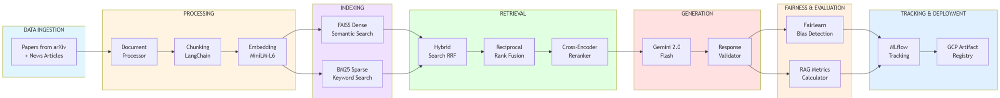

# ResearchAI RAG Pipeline - Model Building

## Table of Contents
- [Project Overview](#project-overview)
- [Pipeline Architecture](#pipeline-architecture)
- [Key Features](#key-features)
- [System Components](#system-components)
- [Installation & Setup](#installation--setup)
- [Usage Guide](#usage-guide)
- [Fairness & Bias Mitigation](#fairness--bias-mitigation)
- [Logging & Monitoring](#logging--monitoring)
- [Evaluation Framework](#evaluation-framework)
- [Deployment](#deployment)
---

## Project Overview

### What is this Pipeline?

This is a **production-ready Retrieval-Augmented Generation (RAG) pipeline** designed to answer questions about technology trends by retrieving and synthesizing information from research papers (arXiv) and news articles.

**Problem it Solves:** Traditional LLMs have knowledge cutoffs and can hallucinate. This pipeline ensures responses are:
- Grounded in actual sources (papers & news)
- Up-to-date with latest tech trends
- Fair across different sources and topics
- Validated for quality

### Pipeline Brief

```
Input: User Query → [Hybrid Retrieval] → [Reranking] → [LLM Generation] → Output: Cited Response
                            ↓                                ↓
                    [Fairness Check]              [Validation & Metrics]
```

**Flow:**
1. **Indexing Phase**: Process papers/news → Create chunks → Generate embeddings → Build indexes (FAISS + BM25)
2. **Query Phase**: User query → Hybrid search → Rerank results → Generate response → Validate & check fairness
3. **Evaluation Phase**: Run test queries → Calculate metrics → Check thresholds → Push to registry if passing

---

## Pipeline Architecture


---

## Key Features

###  Hybrid Retrieval System
- **FAISS (Dense)**: Semantic similarity using embeddings
- **BM25 (Sparse)**: Keyword-based retrieval
- **Reciprocal Rank Fusion**: Combines both methods optimally
- **Cross-Encoder Reranking**: Fine-tunes results for relevance

###  Fairness & Bias Detection
- **Fairlearn Integration**: Uses demographic parity metrics
- **Multi-dimensional Analysis**: Checks bias across sources, categories, query complexity
- **Real-time Fairness Scoring**: Every query gets fairness assessment
- **Actionable Warnings**: Specific recommendations for bias mitigation

###  Comprehensive Evaluation
- **Response Validation**: 7 quality checks per response
- **Retrieval Metrics**: Precision, diversity, source distribution
- **Generation Metrics**: Length, citations, similarity
- **Threshold-based Gating**: Only deploy models meeting quality standards

###  Experiment Tracking
- **MLflow Integration**: Track all experiments automatically
- **Metric Logging**: Validation scores, fairness scores, performance metrics

###  Production Deployment
- **GCP Artifact Registry**: Push validated models to cloud
- **Incremental Updates**: Add new data without rebuilding
- **Model Versioning**: Semantic versioning with auto-timestamps

---

## System Components

### Core Pipeline (`pipeline.py`)
**Purpose**: Orchestrates the entire RAG workflow

**Key Methods:**
- `index_documents()`: Build indexes from papers/news
- `update_indexes()`: Incrementally add new documents
- `query()`: Process user queries end-to-end
- `load_indexes()`: Load pre-built indexes
- `push_to_artifact_registry()`: Deploy to GCP

### Data Processing

#### Document Processor (`data_processing/document_processor.py`)
- Normalizes papers and news into standard format
- Extracts metadata (authors, dates, categories)
- Filters by relevance and recency

#### Chunker (`data_processing/chunking.py`)
- Creates hierarchical chunks (summary + detailed)
- Uses RecursiveCharacterTextSplitter from LangChain
- Different strategies for papers vs news

#### Embedder (`data_processing/embedding.py`)
- Model: `sentence-transformers/all-MiniLM-L6-v2`
- Hybrid embeddings: 70% content + 30% category
- Batch processing for efficiency

### Retrieval System

#### Hybrid Retriever (`retrieval/retriever.py`)
**Combines Dense + Sparse Search:**

#### FAISS Vector Store (`retrieval/vector_store.py`)
- Stores dense embeddings
- Supports Flat, IVF, and HNSW indexes
- Cosine similarity search

#### BM25 Index (`retrieval/bm25_index.py`)
- Keyword-based sparse retrieval
- Configurable k1 and b parameters
- Fast exact search

#### Reranker (`retrieval/reranker.py`)
- Model: `cross-encoder/ms-marco-MiniLM-L-6-v2`
- Combines original scores with rerank scores
- Weighted fusion (configurable)

### Generation

#### Response Generator (`generation/generator.py`)
- Model: Gemini 2.0 Flash
- Context preparation from retrieved docs
- Citation extraction
- Streaming support

#### Response Validator (`generation/response_validator.py`)
**7 Quality Checks:**
1. Has meaningful content
2. Includes citations
3. Citations are valid
4. Relevant to query
5. Appropriate length
6. Good structure
7. No hallucination indicators

### Evaluation & Fairness

#### RAG Bias Detector (`evaluation/model_bias_detector.py`)

**Fairness Dimensions:**
- **Query Complexity**: Simple, intermediate, advanced
- **Domain Type**: AI/ML, cybersecurity, cloud, web3, robotics
- **User Experience**: Beginner, intermediate, expert
- **Geographic Context**: North America, Europe, Asia Pacific, global
- **Source Type**: Academic, industry, news, community

**Metrics:**
- Demographic Parity Difference (closer to 0 = fairer)
- Demographic Parity Ratio (closer to 1 = fairer)
- Source diversity ratio
- Category diversity ratio

#### RAG Metrics Calculator (`evaluation/metrics.py`)
- Retrieval: Precision, recall, diversity
- Generation: Length, citations, similarity
- End-to-end: Response time, tokens/sec

#### Experiment Tracker (`evaluation/experiment_tracker.py`)
- Logs to MLflow automatically
- Tracks config, metrics, fairness reports
- Version control for experiments

### Deployment

#### Artifact Registry Pusher (`deployment/artifact_registry_pusher.py`)
**Packages and Deploys Models:**
- Creates tarball with indexes, configs, metadata
- Uploads to GCP Artifact Registry
- Version management (list, download, delete)
- Metadata includes fairness scores

---

## Installation & Setup

### Prerequisites
```bash
# Python 3.8+
python --version

# Google Cloud SDK (for deployment)
gcloud --version
```

### Install Dependencies
```bash
pip install -r requirements.txt
```

### Configuration

#### 1. Set Environment Variables
```bash
# Required
export GEMINI_API_KEY="your-gemini-api-key"
export GCP_PROJECT_ID="your-gcp-project"  # For deployment

# Optional
export MLFLOW_TRACKING_URI="./mlruns"  # Default
```

#### 2. Update `config/settings.py` (if needed)
```python
# Embedding settings
embedding:
  model_name: "sentence-transformers/all-MiniLM-L6-v2"
  dimension: 384

# Retrieval settings
retrieval:
  top_k: 10
  dense_weight: 0.6
  sparse_weight: 0.4
  
# Generation settings
generation:
  model_name: "gemini-2.0-flash-exp"
  temperature: 0.3
```

---

## Usage Guide

### 1. Build Indexes (First Time)

```bash
python example.py \
  --papers data/papers.json \
  --news data/news.json
```

**What this does:**
- Processes documents
- Creates chunks
- Generates embeddings
- Builds FAISS + BM25 indexes
- Saves to disk (`./faiss_indexes/`, `./bm25_indexes/`)

### 2. Load Existing Indexes

```bash
python example.py --load-existing
```

**What this does:**
- Skips indexing
- Loads pre-built indexes from disk
- Ready for querying immediately

### 3. Update Indexes (Incremental)

```bash
python example.py \
  --update \
  --papers data/new_papers.json \
  --news data/new_news.json
```

**What this does:**
- Loads existing indexes
- Adds new documents without rebuilding
- Appends to existing indexes
- Saves updated indexes

**Use Case:** Daily/weekly data refresh

### 4. Run Queries

```python
from pipeline import TechTrendsRAGPipeline

# Initialize
pipeline = TechTrendsRAGPipeline(enable_tracking=True)
pipeline.load_indexes()

# Query
result = pipeline.query(
    query="What are the latest developments in reinforcement learning for LLMs?"
)

# Access results
print(result['response'])  # Generated answer
print(result['sources'])  # Citations
print(result['validation']['overall_score'])  # Quality: 0.0-1.0
print(result['bias_report']['overall_fairness_score'])  # Fairness: 0.0-1.0
```

### 5. Automated Indexing from Data Pipeline

```bash
python indexing_script.py
```

**What this does:**
- Monitors `../data/cleaned/` for new JSON files
- Automatically indexes new data
- Moves processed files to `../data/processed/`
- Updates existing indexes

**Workflow Integration:**
```
Data Pipeline → ../data/cleaned/ → indexing_script.py → Updated Indexes → Move data from ../data/cleaned/ to ../data/preprocessed/
```

### 6. Model Evaluation

```bash
python simple_evaluate.py \
  --test-data test_queries.csv \
  --validation-threshold 0.7 \
  --fairness-threshold 0.6 \
  --output evaluation_report.json
```

**Test with queries (`test_queries.csv`):**
- Runs all test queries
- Calculates metrics (validation, fairness, similarity)
- Checks thresholds
- Generates report
- Pass/Fail decision

### 7. Deploy to GCP Artifact Registry

```bash
python simple_evaluate.py \
  --test-data test_queries.csv \
  --push-to-registry \
  --project-id your-gcp-project \
  --location us-central1 \
  --repository rag-models \
  --version v1.0.0
```

**What this does:**
- Runs evaluation
- If PASSED → Creates tarball (indexes + metadata)
- Uploads to GCP Artifact Registry
- Saves artifact path
---

## Fairness & Bias Mitigation

### Problem Statement
RAG systems can exhibit bias in:
1. **Source Bias**: Over-representing certain sources
2. **Category Bias**: Favoring specific topics
3. **Demographic Bias**: Different performance across user groups
4. **Temporal Bias**: Recency bias affecting quality

### Our Solution: Multi-Layered Fairness Framework

#### Layer 1: Retrieval Diversity

Diversity filtering ensures variety in retrieval results.

#### Layer 2: Fairlearn-Based Bias Detection

**Metrics:**
- **Demographic Parity Difference**: Measures selection rate difference between groups
- **Demographic Parity Ratio**: Ratio of selection rates (ideal = 1.0)

#### Layer 3: Real-Time Fairness Warnings
Every query automatically generates warnings when fairness issues are detected, logged to MLflow and console for immediate visibility.

#### Layer 4: Threshold-Based Gating
Models with fairness scores below threshold (default: 0.6) are automatically blocked from deployment, ensuring only fair models reach production.
### Bias Mitigation Strategies Implemented

| Strategy | Implementation | Location |
|----------|---------------|----------|
| **Diverse Retrieval** | Prioritize documents from under-represented sources | `retriever.py::_diversify()` |
| **Source Balancing** | Retrieve equal numbers from papers and news | `retriever.py::_dense_search()` |
| **Category Weighting** | 30% category embedding in hybrid embeddings | `embedding.py::embed_chunks()` |
| **Fairlearn Monitoring** | Real-time demographic parity checks | `model_bias_detector.py` |
| **Quality Gating** | Block deployment if fairness score < threshold | `simple_evaluate.py` |
| **Logging & Alerts** | Log all fairness issues to MLflow | `experiment_tracker.py` |

## MLflow Experiment Tracking

**What Gets Logged to MLflow:**

**Parameters:**
```python
mlflow.log_param("llm_model", "gemini-2.0-flash-exp")
...
...
```

**Metrics:**
```python
mlflow.log_metric("fairness_overall_score", 0.756)
...
...
```

**Artifacts:**
```python
mlflow.log_text(response, "response.txt")
mlflow.log_dict(metrics, "metrics.json")
mlflow.log_dict(fairness_report, "fairness_report.json")  
```

### Viewing MLflow Dashboard

```bash
# Start MLflow UI
mlflow ui --port 5000

# Open browser
http://localhost:5000
```
---

## Evaluation Framework

### Overview

The evaluation framework ensures only high-quality, fair models are deployed.

```
Test Queries → Generate Responses → Calculate Metrics → Check Thresholds → Deploy?
                                           ↓
                                  [Validation + Fairness]
```

### Metrics Calculated

#### 1. Validation Metrics (Quality)

**Weights:**
- Content: 30%
- Citations: 20%
- Citation Validity: 15%
- Relevance: 20%
- Length: 5%
- Structure: 10%

#### 2. Fairness Metrics

**Components:**
- Source diversity (20%)
- Category diversity (15%)
- Retrieval quality (20%)
- Response quality (20%)
- Fairlearn fairness (25%)

### Threshold-Based Gating

**Default Thresholds:**
- Validation Score: ≥ 0.70
- Fairness Score: ≥ 0.60
- Pass Rate: ≥ 80% of queries

### Running Evaluation

**Command:**
```bash
python simple_evaluate.py \
  --test-data test_queries.csv \
  --validation-threshold 0.7 \
  --fairness-threshold 0.6 \
  --output evaluation_report.json
```
---

## Deployment

### GCP Artifact Registry Setup

#### 1. Create Repository (One-Time)
```bash
# Login to GCP
gcloud auth login

# Set project
gcloud config set project YOUR_PROJECT_ID

# Create repository
gcloud artifacts repositories create rag-models \
  --repository-format=generic \
  --location=us-central1 \
  --description="RAG model artifacts"
```

#### 2. Configure Permissions
```bash
# Grant access to service account
gcloud artifacts repositories add-iam-policy-binding rag-models \
  --location=us-central1 \
  --member="serviceAccount:YOUR_SA@PROJECT.iam.gserviceaccount.com" \
  --role="roles/artifactregistry.writer"
```

### Deployment Workflow

#### Automated Deployment (with Evaluation)
```bash
# Evaluate + Deploy if passing
python simple_evaluate.py \
  --test-data test_queries.csv \
  --push-to-registry \
  --project-id your-gcp-project \
  --location us-central1 \
  --repository rag-models \
  --version v1.0.0
```

**What Happens:**
1.   Run evaluation on test queries
2.   Check validation threshold (≥ 0.70)
3.   Check fairness threshold (≥ 0.60)
4.   If PASSED → Package artifacts
5.   Upload to GCP Artifact Registry
6.   Save artifact path